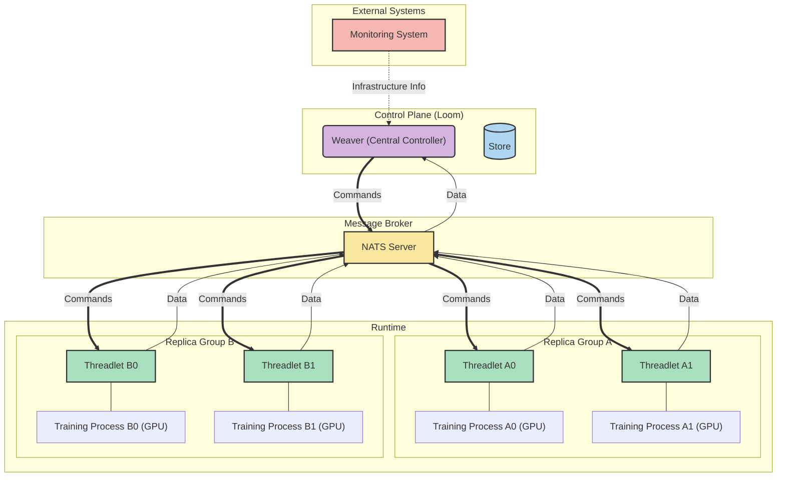

# torchLoom

torchLoom is an active controller framework for PyTorch, enabling dynamic, fault-tolerant, and efficient distributed machine learning (ML) training. It addresses the growing complexity of modern ML workloads, which often involve heterogeneous tasks and require more than static scheduling. Inspired by torchFT, torchLoom extends the concept of a central manager by introducing a proactive **Weaver** controller service and **Threadlet** agents within each training process. The Weaver proactively orchestrates the distributed system, managing aspects like fault tolerance, resource optimization, and even real-time adjustments to training strategies, while Threadlets act as local agents handling monitoring and control tasks.

It is inspired by [torchFT](https://github.com/pytorch/torchft), an experimental framework for fault tolerance distributed training in PyTorch. torchFT introduces the concept of a `Manager` within each training process and a `Lighthouse` that orchestrates failure detection and failure recovery through run-time process group reconfiguration, live checkpoint recovery, and failure detection. In contrast to torchFT's coordination of a distributed quorum algorithm and relatively passive role, torchLoom adopts a more aggressive approach, actively providing new functionalities to the training process.

## Overview

## Why torchLoom?

Distributed Machine Learning (ML) systems have evolved beyond the static, SPMD-centric "device-mesh + static schedule" approach, requiring more dynamic control to manage heterogeneous workloads. Modern workloads, including semi-synchronous training, RLHF pipelines, Mixture-of-Experts (MoE), and heterogeneous accelerators, are inherently MPMD (Multiple Program, Multiple Data). The complexities in MPMD introduce considerations like handling complex fault tolerance requirements, making optimizations due to physical resource availability (e.g. network bandwidth), adapting synchronization strategies (e.g., LocalSGD), switching optimizers (e.g., Muon), implementing more efficient collective communications (e.g., PCCL), or dynamically adjusting the current training strategy based on runtime metrics.

Recent systems research points to the need for a controller in ML training:
- **HybridFlow (2024)**: Moves all control logic to a single controller, simplifying RLHF pipeline programming.
- **Pathways (2022)**: Uses centralized scheduling to enable fine-grained task routing across thousands of devices.
- **PCCL (2025)**: Leverages runtime-tuned collective communication strategies for higher efficiency, uses a single Master node for network optimization and fault tolerance.

torchLoom is that active controller. At its core, it is composed of two components, the **Weaver** controller service, and the **Threadlet** agent. The Weaver service acts as the central planner, dynamically coordinating the interactions and state of distributed workers to optimize performance, fault tolerance, and resource utilization in real-time. The Weaver service communicates with a Threadlet process spawned in each training process. The Threadlet acts as a sidecar that manages logging, monitoring, I/O control, and configuration management.

## Design Goals

The key goals for torchLoom are:
- **MPMD-first**: Support complex control and data flows with adaptive, flexible algorithms.
- **Single Controller, Multiple Data Flows**: Centralize all decision-making in one Weaver service and keeping the training workers focused on data flow. This centralized control simplifies global coordination and provides a holistic system view, drawing inspiration from systems like Google's Pathways and Bytedance's Hybridflow.
- **Fault tolerance**: Achieve both torchFT style quorum-based HSDP fault-tolerance, whilst introducing the controller to achieve proactive fault tolerance capable of handling SPMD usecases.
- **Network-aware**: Inspired by work like PCCL, communication-efficient optimizers (DeMo), low-communication allreduces (int8 Allreduce, Mirror Reduce), and network-aware training algorithms (DiLoCo), torchLoom treat these algorithm choices as runtime-mutable parameters to dynamically optimize network communication.

## Overview

Unlike traditional orchestration frameworks that focus on deployment and scheduling, torchLoom provides run-time monitoring and control of the training process itself. It enables:

- **Real-time failure detection** and recovery for devices and training processes
- **Dynamic configuration adjustment** without stopping training
- **Resource mapping** between hardware devices and training processes

## Typical Workflows Enabled

torchLoom enables several workflows that provide adaptability, infrastructure-aware optimization, proactive fault tolerance, and interactive debugging:

### Dynamic Training Configuration
- **Semi-Synchronous Training Adjustments**: Dynamically adjust parameters such as synchronization frequency (e.g., sync_every) based on network conditions or loss curve convergence.
- **Optimizer Switching**: Switch to more efficient optimizers (e.g., PowerSGD or Top-K SGD) depending on network conditions or training phase.
- **Adaptive Parameters**: Dynamically adjust gradient clipping thresholds, noise injection levels, or even model architecture.

### Infrastructure-Aware Optimization
- **Dynamic load balancing** and batch size assignment
- **Node failure detection** and replacement using telemetry data from monitoring systems
- **Adaptive Network-Aware Recovery**: Ensure recovery occurs only when network conditions are optimal

### Advanced Fault Tolerance
- **Dynamic Reconfiguration**: Coordinate changes in parallelism structure (Data/Pipeline/Tensor Parallelism) to maintain training continuity
- **Message Rerouting**: In MoE architectures, reroute messages to healthy experts or replicas when nodes fail
- **Proactive Failure Prediction**: Use time-series models to predict GPU or worker failures based on telemetry data

### Interactive Exploration and Debugging
- **Interactive Debugging**: Enable interactive exploration of the loss landscape via a web UI, where controls are NATS messages to the Weaver

## Architecture

torchLoom serves as a central weaver for the entire training environment, connecting monitoring systems with training processes through a lightweight messaging system.

### Key Components

- **Weaver**: Central service that maintains device-to-replica mappings and coordinates failure responses
- **Threadlet**: Lightweight agent integrated into each training process that manages logging, monitoring, I/O control, and configuration management
- **NATS Messaging**: Lightweight pub/sub communication layer for system events
- **Monitor CLI**: Command-line interface for manual control and testing

### Architecture Diagram

## Explore More

- Check out the [examples](examples) for more details on how to use torchLoom.
- Check out the [tutorials](tutorials) for more details on how to use torchLoom.
- Check out the [docs](docs) for more details on the design and implementation of torchLoom.
- Check out the [contributing](contributing) for more details on how to contribute to torchLoom.
- Check out the [contributors](docs/CONTRIBUTORS.md) to see who has contributed to torchLoom.
- Check out the [license](license) for more details on the license of torchLoom.
