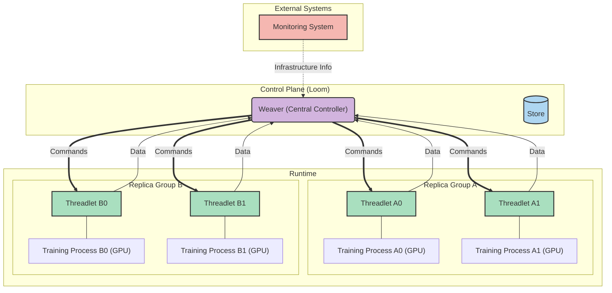

## Architecture

torchLoom is the control plane of serves as a central weaver for the entire training environment, connecting monitoring systems with training processes through a lightweight messaging system.

### Key Components

1. **Weaver**: Central service that maintains the device-to-replica mapping and coordinates responses to failures
2. **Manager Integration**: Direct integration with TorchFT Manager in each training process
3. **NATS Messaging**: Pub/sub communication layer for system events
4. **Monitor CLI**: Command-line interface for manual control and testing

### Architecture Diagram



The diagram above illustrates the high-level architecture of torchLoom.

- **Runtime**: This component contains the **Replica Groups**.
    - **Replica Groups (A & B)**: Each group consists of training processes running on GPUs, with their associated **Threadlets**. These groups are situated side-by-side within the Runtime environment.
- **Control Plane**: This houses the **Weaver**.
    - **Weaver**: The central controller, responsible for orchestrating communication between the Runtime (via Threadlets) and External Systems.
- **Threadlets**: Integrated into each training process within the Replica Groups, they communicate data to the Weaver and receive commands.
- **External Systems**: Includes the **Monitoring System**, which sends infrastructure information to the Weaver.

This architecture clearly separates the runtime environment where training occurs from the central control and external monitoring components.

## Implementation Details

### Environment Configuration

torchLoom can be configured through environment variables:

```python
os.environ["torchLoom_ADDR"]  # Default: nats://localhost:4222
```

All constants are defined in `torchft/torchLoom/constants.py`.

### Device-Replica Mapping (DRMap)

The DRMap is the core data structure that enables torchLoom to translate between monitoring system events (device_uuid) and training system events (process_id).

The mapping is implemented as two related maps:

1. `device_to_pid`: Maps hardware device IDs to training replica IDs
2. `pid_to_devices`: Maps training replica IDs to hardware device IDs

This is designed as a flexible many-to-many mapping:
- Each device can be associated with multiple replicas
- Each replica can span multiple devices
