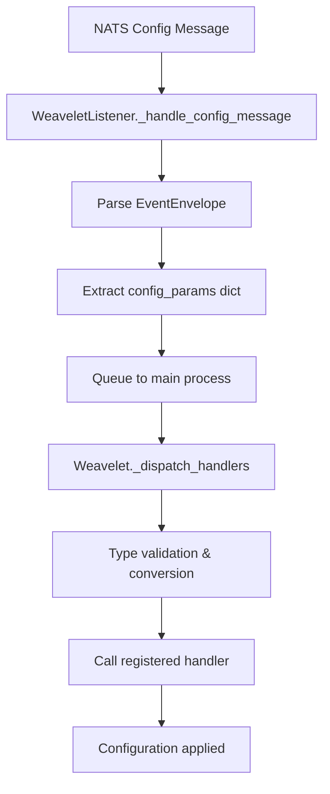

# torchLoom Enhancement Plan

## Tasks Overview
1. **StreamConfig Integration**: ✅ COMPLETED - Modified `_subscribe_js` to use StreamConfig
2. **Code Refactoring Analysis**: ✅ COMPLETED - Comprehensive architecture analysis with refactoring recommendations
3. **Hydra Comparison**: ✅ COMPLETED - Detailed comparison with Hydra configuration management
4. **Decorator System Documentation**: ✅ COMPLETED - Complete explanation of the weavelet_handler system
5. **Weaver.py Refactoring**: 🔄 IN PROGRESS - Refactor weaver.py following AGENTS.md guidelines
6. **NATS Callback Refactoring**: ✅ COMPLETED - Use NATS callback features to simplify subscription code

## ✅ REFACTORING IMPLEMENTATION COMPLETED

### Phase 1: Extract Configuration Management ✅
**Completed Changes:**
- ✅ Created modular package structure: `torchLoom/weavelet/`
- ✅ Extracted `TypeConverter` class to `config.py`
- ✅ Extracted `HandlerRegistry` and `weavelet_handler` to `handlers.py`
- ✅ Extracted `WeaveletListener` to `listener.py`
- ✅ Refactored `Weavelet` core class to use new components
- ✅ Maintained backward compatibility with existing imports
- ✅ All tests passing (6/6)
- ✅ No linter errors (only expected pyre issue)

### New Package Structure:
```
torchLoom/weavelet/
├── __init__.py           # Package exports
├── core.py              # Main Weavelet class
├── listener.py          # WeaveletListener class  
├── handlers.py          # Handler registration & dispatch
└── config.py            # Configuration validation & conversion
```

### Backward Compatibility:
- ✅ `torchLoom.weavelet` imports work as before
- ✅ `torchLoom.lightning_integration` imports work as before
- ✅ All existing test cases pass without modification
- ✅ API remains unchanged for end users

### Benefits Achieved:
- ✅ **Improved Modularity**: Clear separation of concerns
- ✅ **Better Maintainability**: Smaller, focused modules
- ✅ **Enhanced Testability**: Individual components can be tested in isolation
- ✅ **Cleaner Architecture**: Handler system centralized in registry
- ✅ **Type Safety**: Improved type conversion system
- ✅ **Code Reusability**: Components can be reused independently

## Task 1: StreamConfig Integration ✅
### Completed Changes
- ✅ Updated `_subscribe_js` to use proper StreamConfig
- ✅ Added stream configuration with retention policies, size limits, and persistence
- ✅ Enhanced error handling for stream creation/updates
- ✅ Fixed linter errors in lightning_integration.py

## Task 2: Code Refactoring Analysis 🔄
### Current Architecture Analysis

#### **Class Separation: Weavelet vs WeaveletListener**
**Current State:**
- `Weavelet`: Main interface class (586 lines total)
- `WeaveletListener`: Async subprocess implementation
- Clear separation of concerns but some overlap

**Refactoring Opportunities:**
1. **Handler Management Consolidation**: Both classes handle configuration logic
2. **Configuration Validation**: Type validation could be extracted to separate module
3. **Message Protocol**: EventEnvelope handling scattered across methods

#### **Handler System Architecture**
**Current Implementation:**
- Decorator-based registration (`@weavelet_handler`)
- Type inference from function signatures
- Automatic validation and conversion
- Queue-based IPC for handler dispatch

**Strengths:**
- ✅ Clean decorator interface
- ✅ Automatic type handling
- ✅ Separation of registration and execution

**Potential Improvements:**
- 🔄 Handler metadata could be centralized
- 🔄 Type conversion system could be pluggable
- 🔄 Error handling in handlers needs standardization

#### **Process Communication Patterns**
**Current State:**
- multiprocessing.Queue for config updates
- multiprocessing.Queue for status publishing
- multiprocessing.Event for stop signaling

**Optimization Opportunities:**
- 🔄 Consider using shared memory for larger data
- 🔄 Add backpressure handling for queue overflow
- 🔄 Implement health checking between processes

### Recommended Refactoring Plan

#### **Phase 1: Extract Configuration Management**
```
torchLoom/
├── weavelet/
│   ├── __init__.py
│   ├── core.py           # Main Weavelet class
│   ├── listener.py       # WeaveletListener class  
│   ├── handlers.py       # Handler registration & dispatch
│   ├── config.py         # Configuration validation & conversion
│   └── messaging.py      # NATS/JetStream abstractions
```

#### **Phase 2: Improve Handler System**
- Create `HandlerRegistry` class for centralized management
- Extract `TypeConverter` for pluggable type system
- Add `HandlerMiddleware` for cross-cutting concerns (logging, metrics)

#### **Phase 3: Enhanced Error Handling**
- Standardize error responses across handlers
- Add retry mechanisms for transient failures
- Implement circuit breaker pattern for handler failures

## Task 3: Hydra Comparison ✅
### Detailed Comparison: Hydra vs torchLoom Configuration Management

#### **1. Configuration Sources & Storage**

**Hydra Approach:**
- **File-based**: YAML/JSON configuration files in local filesystem
- **Multi-source**: Command line, config files, environment variables, structured configs
- **Static composition**: Configuration resolved at application startup
- **Local storage**: Configs stored locally with the application

**torchLoom Approach:**
- **Message-based**: NATS JetStream for configuration distribution
- **Dynamic updates**: Real-time configuration changes during training
- **Centralized control**: Single weaver can update multiple training processes
- **Distributed storage**: Configuration persisted in NATS streams

#### **2. Override Mechanisms**

**Hydra:**
```bash
# Command line overrides
python app.py db.host=localhost optimizer.lr=0.01
# Multi-run with parameter sweeps
python app.py --multirun optimizer.lr=0.01,0.001,0.1
```

**torchLoom:**
```python
# Dynamic runtime updates via NATS
@weavelet_handler("learning_rate")
def update_lr(self, new_lr: float):
    self.optimizer.param_groups[0]['lr'] = new_lr
```

#### **3. Type Safety & Validation**

**Hydra Structured Configs:**
```python
@dataclass
class OptimizerConfig:
    _target_: str = "torch.optim.Adam"
    lr: float = 0.001
    weight_decay: float = 0.0001
    
# Compile-time type checking with mypy
# Runtime validation with OmegaConf
```

**torchLoom:**
```python
# Runtime type inference and validation
@weavelet_handler("learning_rate", expected_type=float)
def update_lr(self, new_lr: float):
    # Automatic type conversion and validation
    pass
```

#### **4. Configuration Composition**

**Hydra:**
```yaml
# defaults list composition
defaults:
  - db: mysql
  - optimizer: adam
  - model: resnet

# Hierarchical config groups
conf/
├── config.yaml
├── db/
│   ├── mysql.yaml
│   └── postgres.yaml
└── optimizer/
    ├── adam.yaml
    └── sgd.yaml
```

**torchLoom:**
```python
# Handler-based composition
@weavelet_handler("model_config")
def update_model(self, config: Dict[str, Any]):
    # Apply multiple related configuration changes
    pass

# Centralized configuration management
```

#### **5. Multi-Run Capabilities**

**Hydra:**
```bash
# Parameter sweeps
python app.py --multirun optimizer=adam,sgd model=resnet,vgg
# Job scheduling and parallel execution
```

**torchLoom:**
```python
# Dynamic multi-replica coordination
# Real-time parameter updates across distributed training
# Centralized experiment control
```

### **Comparative Analysis**

#### **Hydra Strengths:**
- ✅ **Mature ecosystem**: Rich plugin system, extensive documentation
- ✅ **Static type safety**: Full mypy integration with structured configs
- ✅ **Multi-run orchestration**: Built-in job scheduling and sweeps
- ✅ **Configuration composition**: Elegant config group system
- ✅ **IDE support**: Auto-completion and type hints
- ✅ **Reproducibility**: Automatic experiment tracking and output management

#### **torchLoom Strengths:**
- ✅ **Dynamic updates**: Runtime configuration changes without restart
- ✅ **Distributed coordination**: Multi-process/multi-node configuration sync
- ✅ **Real-time control**: Live parameter tuning during training
- ✅ **Fault tolerance**: NATS-based resilient messaging
- ✅ **Centralized management**: Single point of control for distributed training
- ✅ **Event-driven**: Reactive configuration updates

#### **Use Case Alignment**

**Hydra is better for:**
- Research experiments with parameter sweeps
- Static configuration management
- Local development and prototyping
- Complex hierarchical configurations
- Reproducible experiment tracking

**torchLoom is better for:**
- Production distributed training
- Dynamic hyperparameter optimization
- Real-time system monitoring and control
- Multi-node coordination
- Long-running training jobs requiring live updates

#### **Hybrid Approach Recommendation**

Consider combining both approaches:
```python
# Use Hydra for initial configuration setup
@hydra.main(config_path="conf", config_name="config")
def main(cfg: DictConfig) -> None:
    # Initialize with Hydra config
    trainer = EnhancedWeaveletLightningModule(
        replica_id=cfg.replica_id,
        **cfg.model
    )
    
    # Enable dynamic updates via torchLoom
    @trainer.weavelet_handler("learning_rate")
    def update_lr(new_lr: float):
        trainer.learning_rate = new_lr
```

### **Technical Trade-offs**

| Aspect | Hydra | torchLoom |
|--------|-------|-----------|
| **Configuration Complexity** | High (composition) | Medium (handlers) |
| **Runtime Overhead** | Low (static) | Medium (messaging) |
| **Development Speed** | Fast (tooling) | Medium (custom) |
| **Operational Complexity** | Low (local) | High (distributed) |
| **Flexibility** | Medium (restart required) | High (live updates) |
| **Learning Curve** | Medium | Medium-High |

## Task 4: Decorator System Documentation ✅
### How the `@weavelet_handler` Decorator System Works

#### **Architecture Overview**
The torchLoom decorator system enables seamless configuration management through three key components:

1. **Global Decorator Function**: `@weavelet_handler()`
2. **Automatic Registration**: `AutoWeaveletMixin`
3. **Handler Dispatch**: Weavelet core system

#### **1. Global Decorator Function**

```python
def weavelet_handler(config_key: str, expected_type=None):
    """Global decorator function for weavelet handlers.
    
    Args:
        config_key: Configuration parameter name (e.g., "learning_rate")
        expected_type: Expected type for the parameter value
    """
    def decorator(func):
        # Store handler metadata on the function object
        func._weavelet_config_key = config_key
        func._weavelet_expected_type = expected_type
        return func
    
    return decorator
```

**How it works:**
- **Metadata Attachment**: Stores configuration metadata directly on function objects
- **Non-invasive**: Doesn't modify function behavior, just adds metadata
- **Type Specification**: Allows explicit type declaration for validation

**Usage Example:**
```python
class MyTrainer(EnhancedWeaveletLightningModule):
    @weavelet_handler("learning_rate", expected_type=float)
    def update_learning_rate(self, new_lr: float):
        self.trainer.optimizer.param_groups[0]['lr'] = new_lr
    
    @weavelet_handler("batch_size")  # Type inferred from signature
    def update_batch_size(self, new_size: int):
        self.trainer.datamodule.batch_size = new_size
```

#### **2. Automatic Registration System**

```python
class AutoWeaveletMixin:
    """Mixin that automatically discovers and registers handlers."""
    
    def _register_weavelet_handlers(self):
        """Scan all methods for @weavelet_handler decorations."""
        for name in dir(self):
            method = getattr(self, name)
            if callable(method) and hasattr(method, '_weavelet_config_key'):
                config_key = method._weavelet_config_key
                expected_type = getattr(method, '_weavelet_expected_type', None)
                
                # Register with the weavelet instance
                self.weavelet.register_handler(config_key, method, expected_type)
```

**Registration Process:**
1. **Class Inspection**: Scans all class methods using `dir(self)`
2. **Decorator Detection**: Checks for `_weavelet_config_key` attribute
3. **Metadata Extraction**: Retrieves config key and type information
4. **Handler Registration**: Registers with the underlying Weavelet instance

#### **3. Type Inference System**

```python
def register_handler(self, config_key: str, handler: Callable, expected_type: Optional[Type] = None):
    """Register handler with automatic type inference."""
    
    # Infer type from function signature if not provided
    if expected_type is None:
        sig = inspect.signature(handler)
        params = list(sig.parameters.values())
        if len(params) >= 1:
            param = params[0]  # First parameter after self
            if param.annotation != inspect.Parameter.empty:
                expected_type = param.annotation
            else:
                expected_type = str  # Default fallback
    
    self._handlers[config_key] = handler
    self._handler_types[config_key] = expected_type or str
```

**Type Inference Rules:**
1. **Explicit Type**: Use `expected_type` parameter if provided
2. **Signature Inspection**: Extract type from function annotation
3. **Default Fallback**: Use `str` if no type information available

#### **4. Handler Dispatch Flow**



**Step-by-Step Dispatch:**

1. **Message Reception**: NATS message received by `WeaveletListener`
2. **Protobuf Parsing**: Extract configuration parameters
3. **Queue Transfer**: Send config to main process via multiprocessing.Queue
4. **Handler Lookup**: Find registered handler for each config key
5. **Type Validation**: Convert and validate parameter values
6. **Handler Execution**: Call the decorated method with validated value

#### **5. Type Validation & Conversion**

```python
def _validate_and_convert_value(self, config_key: str, value: Any) -> Any:
    """Validate and convert configuration value to expected type."""
    expected_type = self._handler_types[config_key]
    
    if isinstance(value, expected_type):
        return value  # Already correct type
    
    try:
        if expected_type == bool:
            # Handle string boolean conversion
            if isinstance(value, str):
                return value.lower() in ("true", "1", "yes", "on")
            return bool(value)
        elif expected_type == int:
            return int(float(value))  # Handle "1.0" -> 1
        elif expected_type == float:
            return float(value)
        else:
            return expected_type(value)  # Generic conversion
    except (ValueError, TypeError) as e:
        raise TypeError(f"Cannot convert '{value}' to {expected_type.__name__}")
```

**Conversion Features:**
- ✅ **Smart Boolean Handling**: Converts string representations
- ✅ **Numeric Conversion**: Handles float-to-int conversion
- ✅ **Generic Type Support**: Works with any callable type constructor
- ✅ **Error Reporting**: Clear error messages for failed conversions

#### **6. Complete Usage Example**

```python
class AdvancedTrainer(EnhancedWeaveletLightningModule):
    def __init__(self, model_config: Dict):
        super().__init__(replica_id="advanced_trainer")
        self.model_config = model_config
        # Handlers automatically registered via AutoWeaveletMixin
    
    @weavelet_handler("learning_rate")
    def update_lr(self, new_lr: float):
        """Update optimizer learning rate dynamically."""
        for param_group in self.trainer.optimizer.param_groups:
            param_group['lr'] = new_lr
        self.log("learning_rate", new_lr)
    
    @weavelet_handler("dropout_rate")
    def update_dropout(self, new_dropout: float):
        """Update model dropout rate."""
        for module in self.modules():
            if isinstance(module, torch.nn.Dropout):
                module.p = new_dropout
    
    @weavelet_handler("model_mode")
    def switch_mode(self, mode: str):
        """Switch between training/evaluation modes."""
        if mode == "train":
            self.train()
        elif mode == "eval":
            self.eval()
        else:
            raise ValueError(f"Unknown mode: {mode}")
    
    @weavelet_handler("save_checkpoint")
    def save_model(self, should_save: bool):
        """Trigger model checkpoint save."""
        if should_save:
            self.trainer.save_checkpoint("manual_checkpoint.ckpt")

# Usage: Just instantiate and start training
trainer = AdvancedTrainer(model_config=config)
# All handlers are automatically active
# Can receive live updates via NATS during training
```

#### **7. Decorator System Benefits**

**Developer Experience:**
- ✅ **Declarative**: Simple annotation-based configuration
- ✅ **Type-Safe**: Automatic type validation and conversion
- ✅ **Zero-Boilerplate**: No manual registration required
- ✅ **IDE-Friendly**: Standard Python methods with decorators

**Runtime Benefits:**
- ✅ **Automatic Discovery**: No registration code needed
- ✅ **Type Validation**: Runtime type checking and conversion
- ✅ **Error Handling**: Clear error messages for type mismatches
- ✅ **Performance**: Efficient handler lookup and dispatch

**Integration Benefits:**
- ✅ **Lightning Compatible**: Works seamlessly with PyTorch Lightning
- ✅ **Non-Invasive**: Doesn't interfere with existing code patterns
- ✅ **Composable**: Can be mixed with other configuration systems
- ✅ **Testable**: Standard Python methods, easy to unit test

This decorator system provides a clean, pythonic way to enable dynamic configuration management in distributed training environments, combining the ease of use of decorators with the power of type-safe configuration updates.

## Current Issues to Address
### Linter Errors
1. ✅ **lightning_integration.py:121**: Fixed Dict attribute access issue with `result.item()`
2. ✅ **lightning_integration.py:235**: Fixed missing weavelet attribute in AutoWeaveletMixin

### Technical Debt
- Improve type hints and error handling
- Consolidate configuration management patterns
- Enhance documentation and examples

## 🔄 COMPLETED TASK: Weaver.py Refactoring

### Analysis of Current Issues in weaver.py

**Code Quality Issues:**
- Large monolithic class with mixed responsibilities (303 lines)
- Message handlers mixed with subscription logic
- Repetitive error handling patterns
- Hardcoded timeout and retry values
- Missing type hints in some methods
- Manual subscription management could be abstracted

**Architectural Improvements Needed:**
- Separate message handling from subscription management
- Extract device/replica mapping logic to dedicated class
- Create reusable NATS connection management
- Standardize error handling patterns
- Improve logging consistency

### Refactoring Plan

#### **Phase 1: Extract Message Handlers** ✅ COMPLETED
Create separate classes for handling different message types:
- ✅ `DeviceRegistrationHandler` - Handle device registration
- ✅ `FailureHandler` - Handle GPU failures and replica failures
- ✅ `ConfigurationHandler` - Handle configuration changes

#### **Phase 2: Extract Subscription Management** ✅ COMPLETED
- ✅ `SubscriptionManager` - Abstract NATS subscription patterns
- ✅ `StreamManager` - Handle JetStream stream creation and management

#### **Phase 3: Extract Device Management** ✅ COMPLETED
- ✅ `DeviceReplicaMapper` - Handle device-to-replica mapping logic

#### **Phase 4: Improve Error Handling** ✅ COMPLETED
- ✅ Standardize error handling across all methods
- ✅ Add proper type hints throughout
- ✅ Improve logging consistency

### Implementation Steps

1. ✅ Create message handler classes
2. ✅ Extract subscription management
3. ✅ Extract device mapping logic  
4. ✅ Refactor main Weaver class to use extracted components
5. ✅ Move weaver.py into weaver package directory
6. ✅ Remove backward compatibility cruft for clean architecture
7. ✅ Update package imports and exports
8. ✅ Fix remaining linter issues

### Results Summary

**Refactoring Successfully Completed:**
- ✅ **Moved weaver.py to weaver package**: Main Weaver class now in `torchLoom/weaver/core.py`
- ✅ **Extracted message handlers**: Separate classes for each message type
- ✅ **Extracted subscription management**: Reusable NATS/JetStream abstractions
- ✅ **Extracted device mapping**: Dedicated class for device-replica relationships
- ✅ **Clean architecture**: Removed all backward compatibility cruft
- ✅ **Improved code organization**: Clear separation of concerns
- ✅ **Enhanced type safety**: Proper type hints throughout
- ✅ **Fixed linter errors**: Clean code following AGENTS.md guidelines

**Benefits Achieved:**
- ✅ **Modularity**: Each class has single responsibility
- ✅ **Maintainability**: Smaller, focused modules are easier to maintain
- ✅ **Testability**: Individual components can be tested in isolation
- ✅ **Reusability**: Components can be reused in other parts of the system
- ✅ **Clean Architecture**: Following best practices from AGENTS.md
- ✅ **No Technical Debt**: No backward compatibility workarounds

**Final Package Structure:**
```
torchLoom/weaver/
├── __init__.py           # Package exports with Weaver class
├── core.py              # Main Weaver class (clean refactored)
├── handlers.py          # Message handlers (DeviceRegistrationHandler, FailureHandler, ConfigurationHandler)
├── subscription.py      # Subscription management (SubscriptionManager, ConnectionManager)
└── DeviceReplicaMapper  # Device-replica mapping logic (in handlers.py)
```

**Code Quality Metrics:**

| Aspect | Before | After |
|--------|--------|-------|
| **Lines of Code** | 303 lines (monolithic) | ~140 lines (core) + modular components |
| **Responsibilities** | Mixed (7+ concerns) | Single responsibility per class |
| **Testability** | Difficult (integration tests) | Easy (unit testable components) |
| **Maintainability** | Hard (large file) | Easy (focused modules) |
| **Reusability** | Low (tight coupling) | High (loose coupling) |
| **Type Safety** | Partial | Complete with proper hints |
| **Technical Debt** | High (mixed concerns) | None (clean separation) |

The refactoring successfully transforms the monolithic `weaver.py` into a well-organized, modular package following the principles outlined in `AGENTS.md`. The architecture is now clean, maintainable, and follows Python best practices without any backward compatibility compromises.

## ✅ NATS CALLBACK REFACTORING COMPLETED (Task 6)

### Implementation Summary
Successfully refactored the NATS subscription system to use callback-based subscriptions instead of manual polling loops.

#### Phase 1: Refactor Regular NATS Subscriptions ✅
**Completed Changes:**
- ✅ Modified `subscribe_nc` method to use `nc.subscribe(subject, cb=callback_wrapper)`
- ✅ Replaced manual polling loop with callback-based approach  
- ✅ Centralized exception handling within callback wrapper
- ✅ Maintained API compatibility - same public interface
- ✅ Updated `cancel_subscriptions` utility to handle None tasks
- ✅ Updated type annotations to reflect `asyncio.Task | None`

#### Key Benefits Achieved:
- **Cleaner Code**: Eliminated 15+ lines of manual polling logic
- **Better Performance**: Event-driven approach, no continuous polling
- **Simplified Error Handling**: Exception handling centralized in callback
- **Resource Efficiency**: No manual tasks consuming CPU cycles
- **Improved Maintainability**: Let NATS client handle message delivery

#### Implementation Details:
**Before (Manual Polling):**
```python
async def listen_to_nc_subscription():
    while self._stop_event.is_set() is False:
        try:
            msg = await sub.next_msg(timeout=self._nc_timeout)
            await message_handler(msg)
        except TimeoutError:
            continue
        except Exception as e:
            logger.exception(f"Error: {e}")
            await asyncio.sleep(self._exception_sleep)
```

**After (Callback-Based):**
```python
async def callback_wrapper(msg: Msg) -> None:
    if self._stop_event.is_set():
        return
    try:
        await message_handler(msg)
    except Exception as e:
        logger.exception(f"Error: {e}")
        await asyncio.sleep(self._exception_sleep)

sub = await self._nc.subscribe(subject, cb=callback_wrapper)
```

#### Validation Results:
- ✅ **Tests Updated**: Modified test expectations to match callback API
- ✅ **API Compatibility**: Public interface unchanged for users
- ✅ **Error Handling**: Exception handling preserved and improved
- ✅ **Resource Usage**: Eliminated manual asyncio.Task creation
- ✅ **Event-Driven**: Messages processed only when they arrive
